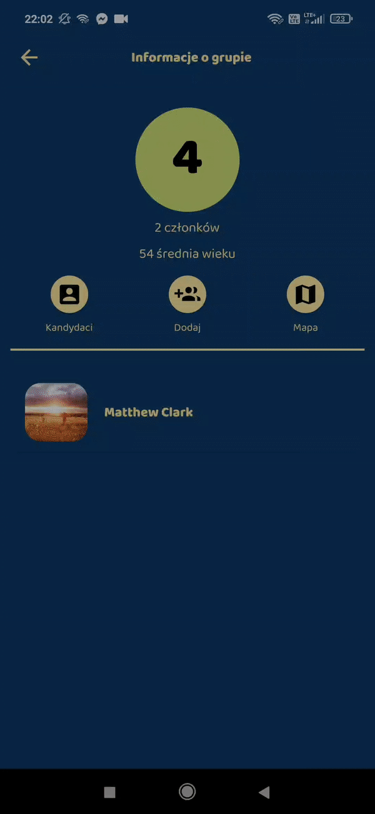

[](https://github.com/BimberTeam/Bimber/commits/master)
[](https://github.com/ellerbrock/open-source-badges/)
[](https://github.com/dwyl/esta/issues)
[](http://hits.dwyl.com/BimberTeam/Bimber)

# Bimber :beers:
*Backend architecture for mobile application.*

*Check the app your yourself by simply downloading an apk file and installing it on your android device: https://github.com/BimberTeam/BimberApp/releases/download/1.0/app.apk*

## Team  :punch:
<table align="center">
  <tr>
   <td align="center"><a href="https://github.com/jmysliv"><br /><sub><b>Jakub Myśliwiec</b></sub></a></td>
    <td align="center"><a href="https://github.com/Qizot"><br /><sub><b>Jakub Perżyło</b></sub></a></td>
   <td align="center"><a href="https://github.com/skusnierz"><br /><sub><b>Sebastian Kuśnierz</b></sub></a></td>
    </tr>
</table>

## About project :question:
***Have you ever felt the need to met new peoples that love the same type of alcohol as you? Peoples, that like to party the exact same way as you? Now Bimber makes meeting those people possible.***


Bimber is a tinder-like app in which you can instead of searching for love search for parties and drinking. You can discover new people by swiping them just like in Tinder but what's different is when you match with another person, you form a party group. It means that other thirsty souls can discover you as a group so more people can party together. You can accept or reject potential party-goers in a dedicated view, it works like voting - if 50% of the group members accept the candidate, he's in. You can add people you discovered to your friends' list with whom you can later create a new group or simply invite them to an existing group. We also implemented a well-known feature you may recall from Snapchat  - a localization map. It helps users to see where they currently are so they can meet together. Just like in Snapchat stories, each group exists for a limited time. Make sure you get in touch with people you like as after 4 days all group history will be gone forever.

### What we learned
During working on that project we learned a lot about team cooperation. We often work simultaneously on the same code base so we have to develop good task management. Luckily GitHub had a great tool for that (Projects). As we worked in a team, we learned how important it is to write clean and readable code, so other team members could easily understand it. At the end it turned out that creating app with team is way more exciting cause you can discuss every ideas together and work out the best solution.

## Technology stack :computer: 
### Backend
To develop our backend API we decided to use a couple of interesting technologies
including:
- Graphql
- Graph database

As we all know dealing with the social network can be tricky that's why we went
for *neo4j* as our storage solution and to build upon that we decided to use
*neo4j-graphql-js* library that almost seamlessly transfers our predefined graphql
schema to proper database queries and mutations.

Of course, using *neo4j-graphql-js* requires using *node.js* which
we all were happy about.  Working with *node.js* and *apollo*
the library was a breeze. Besides using *neo4j* database we decided
to use *redis* just for chat implementation as it is fast, takes
a low memory footprint, and has simple data structures that were
sufficient for the task. Of course to backup code quality, we used
typescript that helps to catch potential bugs that come out due
to javascript nature.

Every social network needs photos, right?
To avoid dealing with external services we decided to use a custom
image service, a golang server for better performance.

### Frontend
Full description of frontend technologies is available [here](https://github.com/BimberTeam/BimberApp)

## Get Started :fire:

Right now backend server is deployed on DigitalOcean so all you have to do to start using app is to download it from [here](https://github.com/BimberTeam/BimberApp/releases/download/1.0/app.apk).

If you want to test the app locally here is quick guide:

Make sure you have installed:
* Docker
* Docker-compose
* Flutter

Then just copy and paste the following commands to run server:
```bash
git clone git@github.com:BimberTeam/Bimber.git
cd Bimber
docker-compose up
```
Then you have to modify server url in mobile app. Firstly clone repository using the following command:
```bash
git clone git@github.com:BimberTeam/BimberApp.git
```
Next open [.env_dev file](bimber/assets/env/.env_dev) and edit it replacing DigitalOcean server ip with your own ip. Then you can build and install your app on your mobile device using the following commands:

```bash
cd BimberApp/bimber
flutter build apk --split-per-abi
flutter install
```

## Frontend demo :iphone:
Here you can see demo of most features our app offers
### Discovering new peoples and groups


### Accepting friend/group requests


### Chatting with your matches


### Checking group info and map


### Voting on new group members


### Adding friends to group



### Creating new group from friends


### Editing your account


